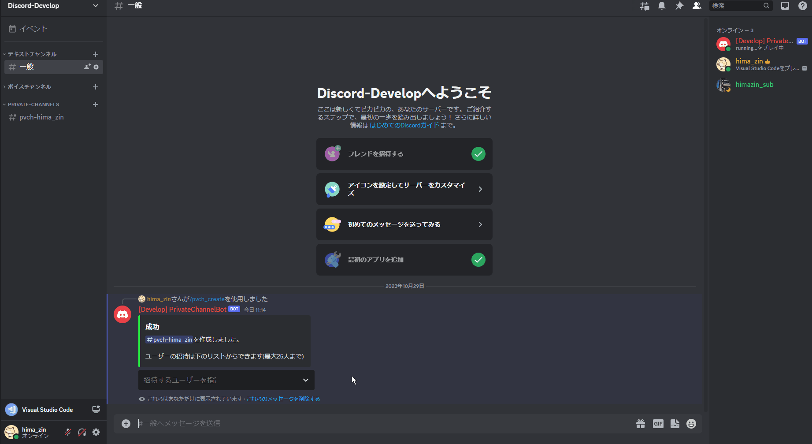
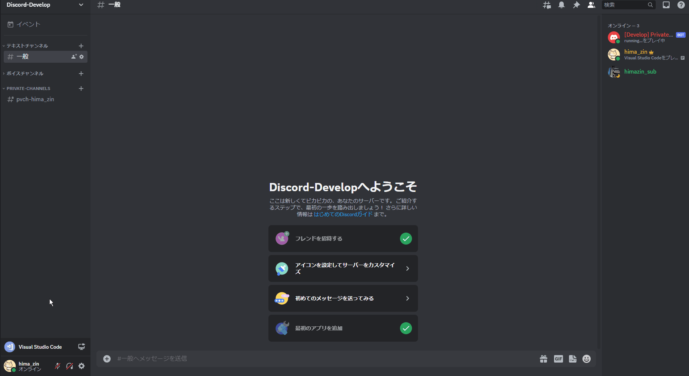
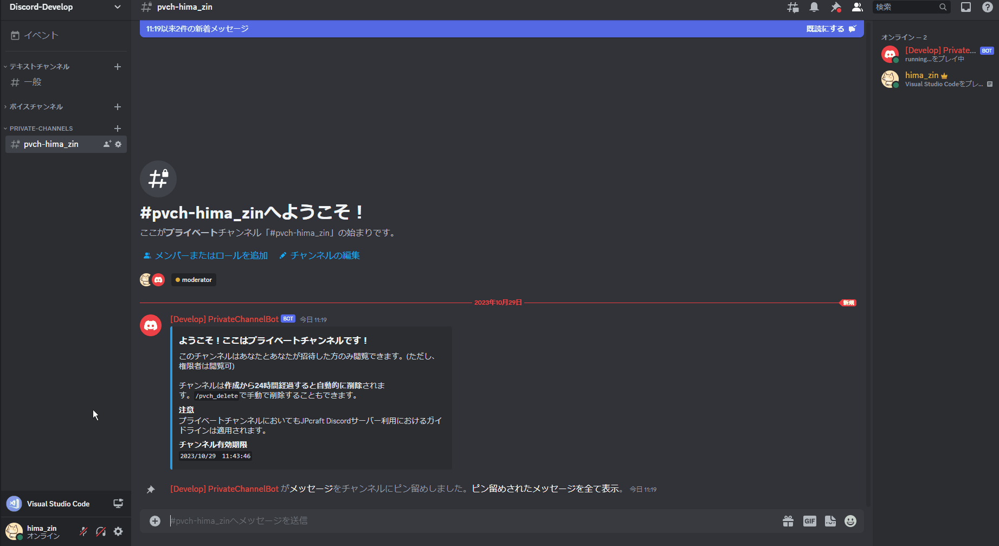
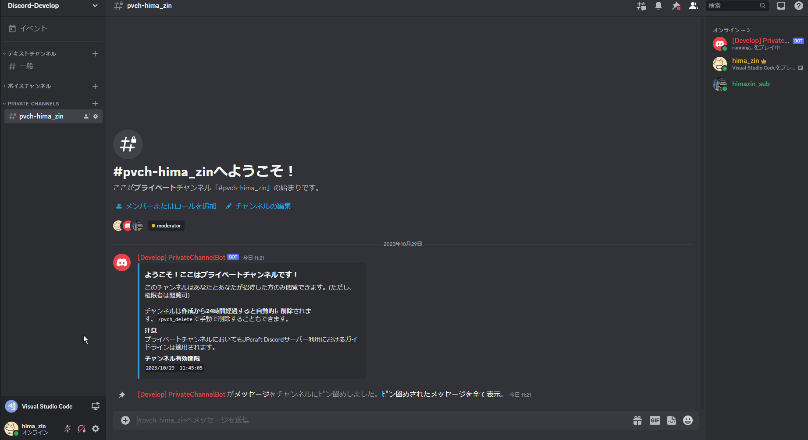
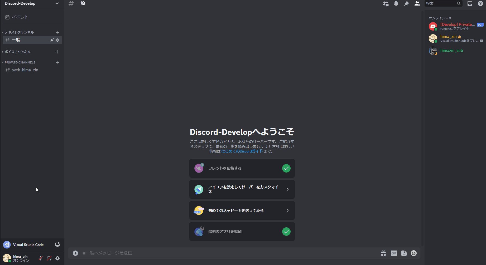

# "PrivateChannelBot", a Discord Bot for creating private channels with a time limit

## Overview
"PrivateChannelBot" is a Discord Bot for creating private channels.

Even users who do not have channel management privileges can create and delete private channels in the Discord server via this bot. In addition, users can be invited and kick.

Normally, the above operations require strong privileges, but this Bot is very useful for running a Discord server, because it does not require general users to be granted privileges.

Furthermore, private channels are automatically deleted after a period of time specified by the administrator.

## Command Description
- `/pvch_create`.
  Creates your own private channel.
  <details><summary>Create private channel (GIF)</summary><div>

  
  </div></details>

  You can also invite users when you create a private channel.
  <details><summary>Invite user (GIF)</summary><div>

  
  '* You can select a user from a select box, or you can specify a user by typing text.
  </div></details>

  - Restrictions
    - Only one channel can be created per user.
    - Commands can only be executed on non-private channels.
    - Cooldown: 3 times in 20 seconds

- `/pvch_delete`.
  Deletes your own private channel.
  - Execution on non-private channels
    <details><summary>Delete private channel 1 (GIF)</summary><div>

    
    </div></details>

  - Execution on a private channel
    <details><summary>Delete private channel 2 (GIF)</summary><div>

    
    </div></details>

  - Restrictions
    - Commands can only be executed by the creator of the private channel.
    - Cooldown: 3 times in 20 seconds

- `/pvch_invite`.
  Invite a user to your own private channel.
  <details><summary>Invite user (GIF)</summary><div>

  
  '* You can select a user from a select box, or you can specify a user by typing text.
  </div></details>

  - Restrictions
    - Commands can only be executed on non-private channels.
    - Bots cannot be invited
    - Cooldown: 3 times in 20 seconds

- `/pvch_leave`.
  Leaves someone else's private channel.
  <details><summary>User leaving (GIF)</summary><div>

  
  </div></details>

  - Restrictions
    - Command can only be executed on private channels.
    - Cannot leave from your own private channel
    - Cooldown: 3 times in 20 seconds

- `/pvch_kick`.
  Kick a user from your own private channel.
  <details><summary>Kick user (GIF)</summary><div>

  
  </div></details>

  - Restrictions.
    - Command can only be executed on private channels.
    - Command can only be executed by the creator of the private channel.
    - Bots, administrator, and channel creators themselves cannot be kick
    - Cooldown: 3 times in 20 seconds

- `/pvch_extend`.
  Extend the expiration date of your own private channel.
  <details><summary>Extend the deadline for deleting channels (GIF)</summary><div>

  
  </div></details>

  - Restrictions
    - Deletion deadline can be extended only under certain conditions.
    The `current expiration date < current time + maximum extension time` must be true.
    
    - Command can only be executed by the creator of the private channel.
    - Cooldown: 1 times in 180 seconds

  - Caution
    - Depending on the total number of private channels, the deadline extension process involves sorting, which is an overloaded process, so the cooldown is longer.

- `/pvch_admin_delete <channel creator>`
  [Admin only] Deletes a private channel.
  <details><summary>Delete private channel (GIF)</summary><div>

  
  </div></details>

  - Restrictions
    - Command can only be executed by administrator.
    - Cooldown: 3 times in 10 seconds.

- `/pvch_admin_kick <target channel> <user to kick>`
  [Admin only] Kick a user from a private channel.
  <details><summary>Kick a user (GIF)</summary><div>

  
  </div></details>

  - Restrictions
    - Command can only be executed by administrator.
    - Cooldown: 3 times in 10 seconds.

- `/pvch_help`
  display help.
  <details><summary>Display help (GIF)</summary><div>

  
  </div></details>

  - Restrictions
    - Cooldown: 3 times in 20 seconds

## For developers
### System Requirements
- Python 3.9.12
- discord.py 2.3.2

### Library installation
```
pip install discord.py loguru
```

### Settings

Create a channel category for your private channel in advance and put its ID in `settings.py`.

Edit `settings.py` according to your Discord server configuration.
```python
TOKEN: str = "DISCORD_BOT_TOKEN"

GUILD_NAME: str = "GUID_NAME"
GUILD_ID: int = 0000000000000000000
CATEGORY_ID: int = 0000000000000000000  # Private Channel Category ID

MODERATOR_ROLE_ID: int = 0000000000000000000
GENERAL_ROLE_ID: int = 0000000000000000000

CHANNEL_TTL_HOUR: int = 24
EXTEND_TTL_HOUR: int = 6
```