# 期限付きプライベートチャンネル作成Discord Bot「PrivateChannelBot」

## 概要
「PrivateChannelBot」はその名の通り、プライベートチャンネルを作成するためのDiscord Botです。

Discordサーバ内で、チャンネルの管理権限を持たないユーザーであっても、このBotを介してプライベートチャンネルの作成および削除することが可能です。さらに、ユーザの招待および追放も行うことができます。

通常、上にあげた操作をするには強力な権限が必要になりますが、このBotを介することで、一般ユーザに権限を付与する必要がないため、Discordサーバの運営において非常に有用です。

さらに、プライベートチャンネルは管理者が指定した期間を経過すると自動的に削除される仕組みとなっています。

## コマンド説明
- `/pvch_create`
  自分のプライベートチャンネルを作成します。
  <details><summary>プライベートチャンネル作成 (GIF)</summary><div>

  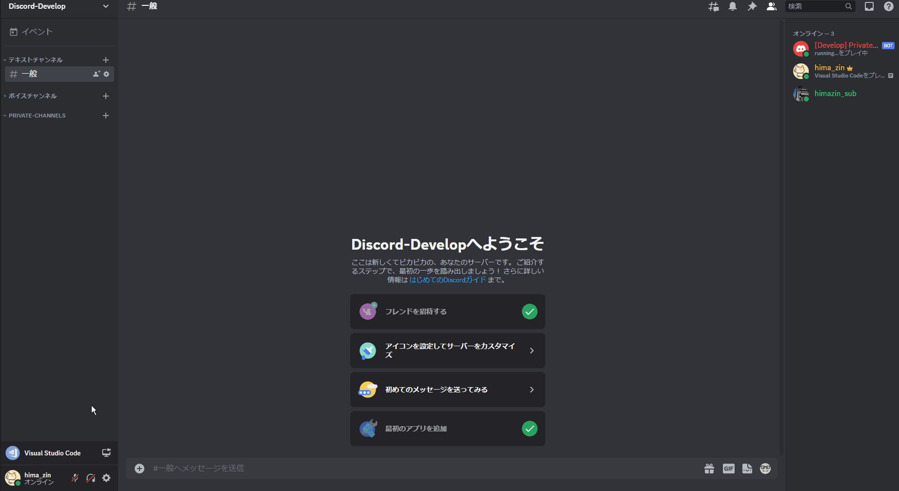
  </div></details>

  プライベートチャンネル作成時にユーザを招待することもできます。
  <details><summary>ユーザ招待 (GIF)</summary><div>

  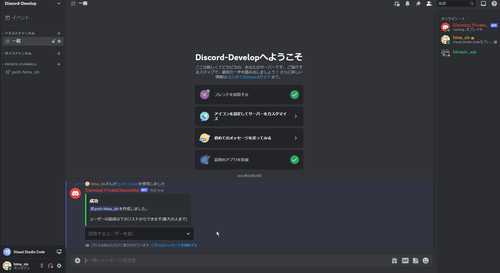
  ※ セレクトボックスからの選択はもちろん文字入力によるユーザ指定も可能です。
  </div></details>

  - 制約
    - 作成できるチャンネル数は**1ユーザにつき1つ**まで
    - コマンドは**プライベートチャンネル以外でのみ実行可能**
    - クールダウン：20秒間に3回

- `/pvch_delete`
  自分のプライベートチャンネルを削除します。
  - プライベートチャンネル以外での実行
    <details><summary>プライベートチャンネル削除1 (GIF)</summary><div>

    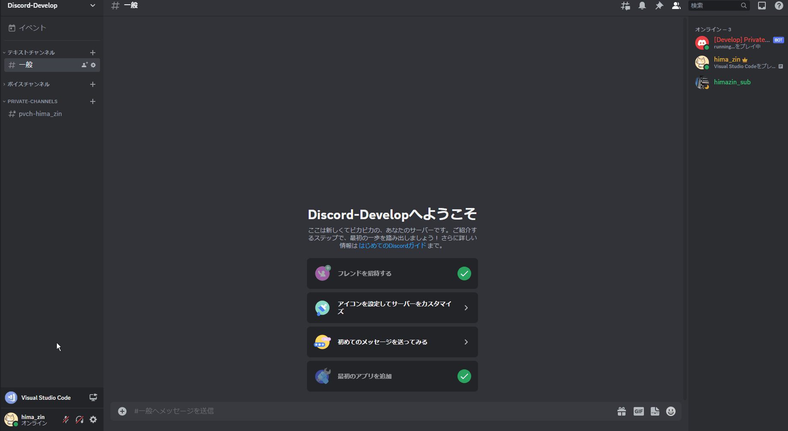
    </div></details>

  - プライベートチャンネルでの実行
    <details><summary>プライベートチャンネル削除2 (GIF)</summary><div>

    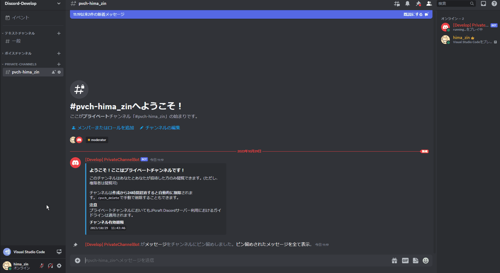
    </div></details>

  - 制約
    - コマンドは**プライベートチャンネルの作成者のみ実行可能**
    - クールダウン：20秒間に3回

- `/pvch_invite`
  自分のプライベートチャンネルにユーザを招待します。
  <details><summary>ユーザ招待 (GIF)</summary><div>

  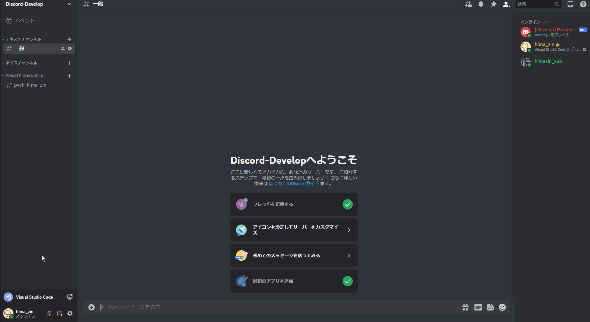
  ※ セレクトボックスからの選択はもちろん文字入力によるユーザ指定も可能です。
  </div></details>

  - 制約
    - コマンドは**プライベートチャンネル以外でのみ実行可能**
    - ボットは招待不可
    - クールダウン：20秒間に3回

- `/pvch_leave`
  他者のプライベートチャンネルを離脱します。
  <details><summary>ユーザ離脱 (GIF)</summary><div>

  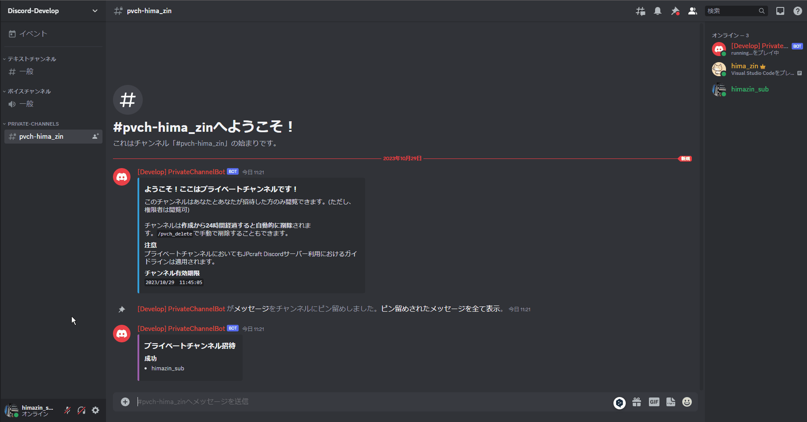
  </div></details>

  - 制約
    - コマンドは**プライベートチャンネルでのみ実行可能**
    - 自分のプライベートチャンネルからの離脱は不可
    - クールダウン：20秒間に3回

- `/pvch_kick`
  自分のプライベートチャンネルからユーザを追放します。
  <details><summary>ユーザ追放 (GIF)</summary><div>

  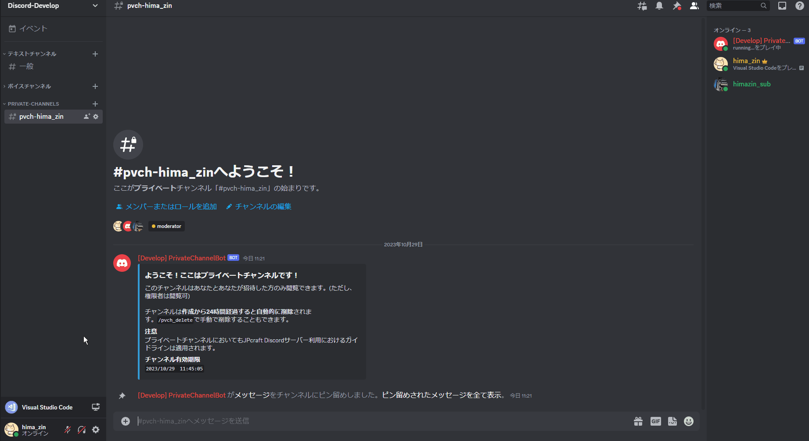
  </div></details>

  - 制約
    - コマンドは**プライベートチャンネルでのみ実行可能**
    - コマンドは**プライベートチャンネルの作成者のみ実行可能**
    - ボット、権限者、チャンネル作成者自身は追放不可
    - クールダウン：20秒間に3回

- `/pvch_extend`
  自分のプライベートチャンネルの期限を延長します。
  <details><summary>チャンネル削除期限を延長 (GIF)</summary><div>

  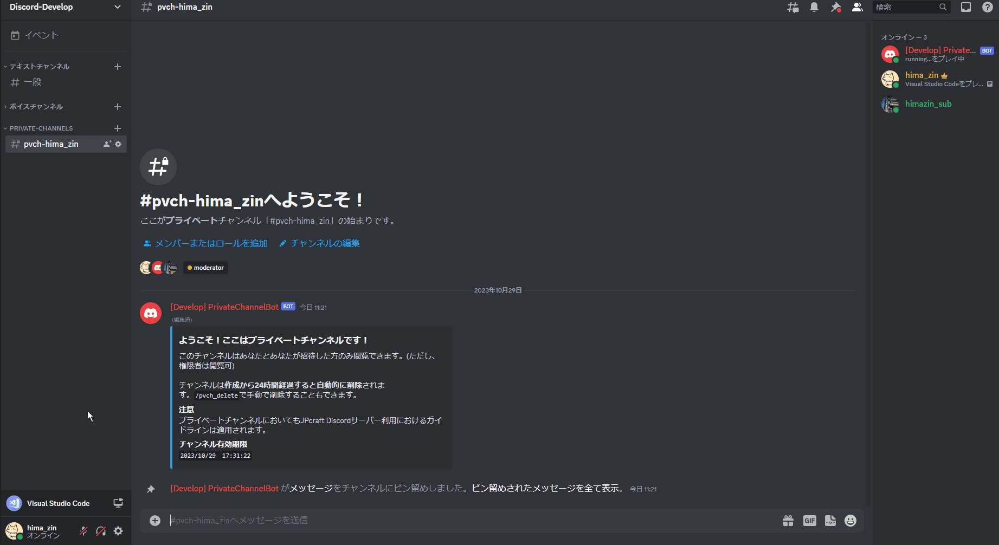
  </div></details>

  - 制約
    - 削除期限は**特定の条件下でのみ延長可能**
    `現削除期限 < 現在時刻 + 最大延長時間`が真となることが条件。
    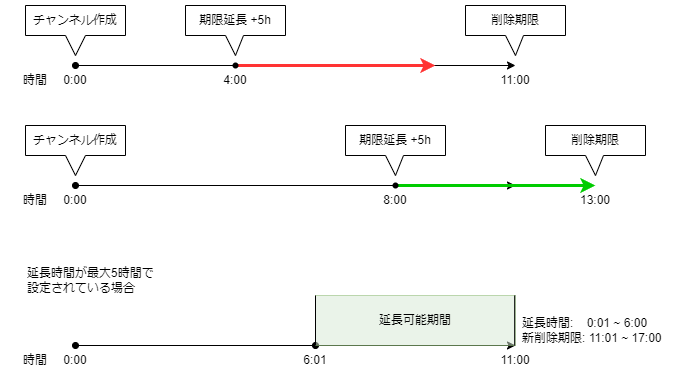
    - コマンドは**プライベートチャンネルの作成者のみ実行可能**
    - クールダウン：**180秒間に1回**

  - 注意
    - プライベートチャンネルの総数によりますが、期限延長はソート処理を伴いそこそこ重い処理なので、クールダウンを厳しめに設けています。

- `/pvch_admin_delete <チャンネル作成者>`
  [権限者専用] プライベートチャンネルの削除。
  <details><summary>プライベートチャンネル削除 (GIF)</summary><div>

  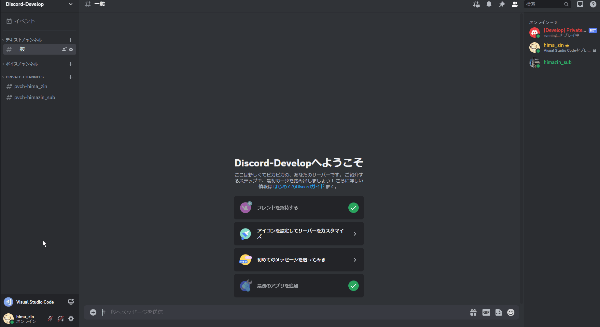
  </div></details>

  - 制約
    - コマンドは**権限者のみ実行可能**
    - クールダウン：10秒間に3回

- `/pvch_admin_kick <対象チャンネル> <追放するユーザ>`
  [権限者専用] プライベートチャンネルからユーザを追放。
  <details><summary>ユーザ追放 (GIF)</summary><div>

  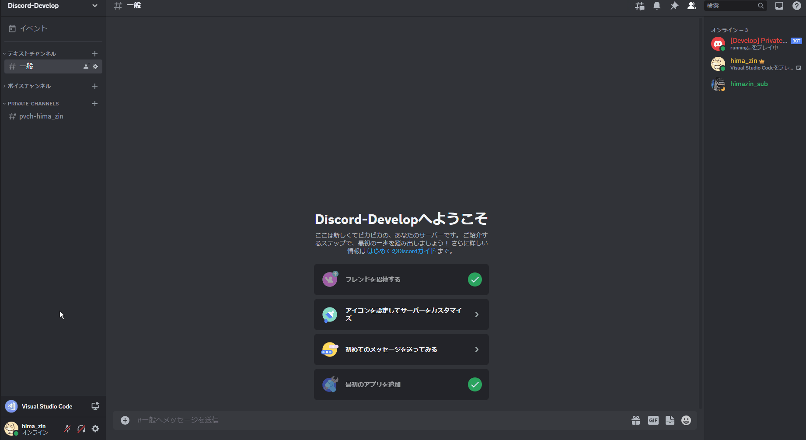
  </div></details>

  - 制約
    - コマンドは**権限者のみ実行可能**
    - クールダウン：10秒間に3回

- `/pvch_help`
  ヘルプを表示します。
  <details><summary>ヘルプ表示 (GIF)</summary><div>

  
  </div></details>

  - 制約
    - クールダウン：20秒間に3回

## 開発者向け
### 動作確認環境
- Python 3.9.12
- discord.py 2.3.2

### ライブラリインストール
```
pip install discord.py loguru
```

### 設定

事前にプライベートチャンネル用のチャンネルカテゴリを作成して、そのIDを`settings.py`に記述してください。

その他、Discordサーバの設定に合わせて`settings.py`を編集してください。
```python
TOKEN: str = "DISCORD_BOT_TOKEN"

GUILD_NAME: str = "GUID_NAME"
GUILD_ID: int = 0000000000000000000
CATEGORY_ID: int = 0000000000000000000  # Private Channel Category ID

MODERATOR_ROLE_ID: int = 0000000000000000000
GENERAL_ROLE_ID: int = 0000000000000000000

CHANNEL_TTL_HOUR: int = 24
EXTEND_TTL_HOUR: int = 6
```